

  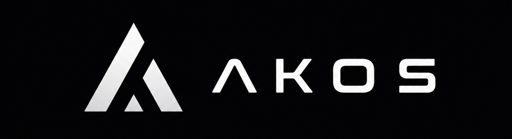

---

**AKOS** é a base de conhecimento estruturada. Voltado para armazenar agentes, projetos, logbooks, prompts e tudo o que aprendo ao longo da jornada — desde disciplinas da faculdade até experimentos com arquitetura de software, linguagens nativas e sistemas operacionais.

---

## 🧭 Eixos

### 🟣 Core
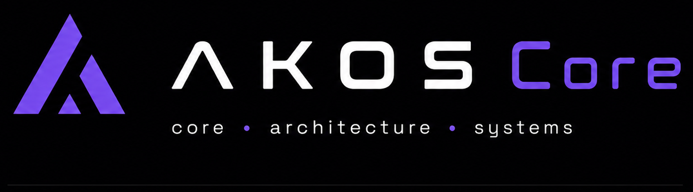

**Core** é a fundação. Reúne os princípios de engenharia de software, padrões arquiteturais e as bases reutilizáveis que orientam toda a AKOS. É onde estão as decisões estruturais e a filosofia por trás dos projetos.

---

### 🔵 Docs
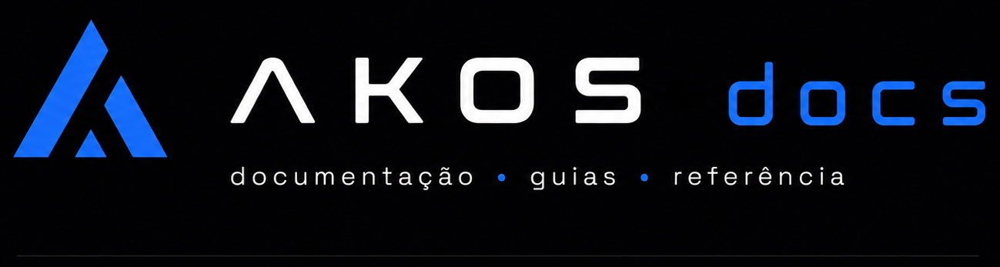

**Docs** é a memória da AKOS. Contém documentação, guias, templates, playbooks e todo o conhecimento que precisa ser registrado e compartilhado — incluindo as conversas com IAs e os insights extraídos de disciplinas.

---

### 🩵 UI
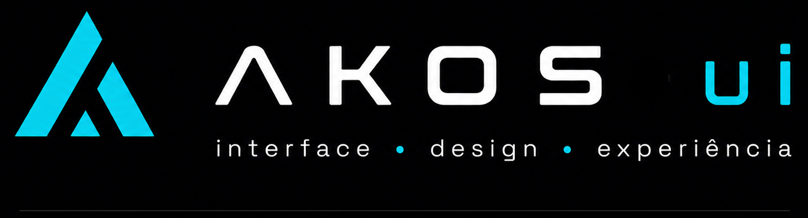

**UI** é o espaço de interfaces, design systems e componentes. Reúne estudos, padrões e implementações relacionadas a experiência do usuário e construção de interfaces nativas — como SwiftUI, Jetpack Compose e UIKit.

---

### 🟢 CLI
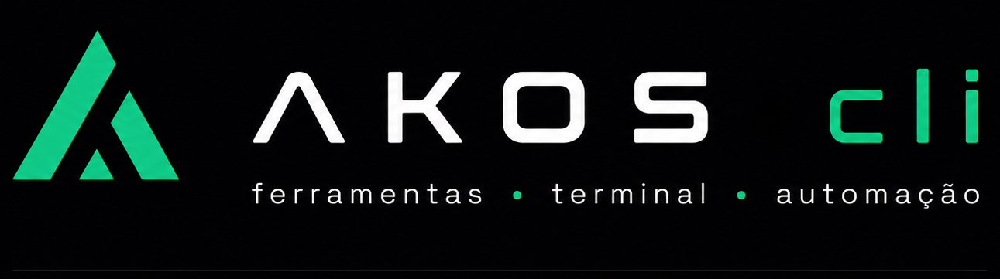

**CLI** agrupa ferramentas, automações e scripts. É onde estão os comandos, utilitários e pipelines que aumentam a produtividade e padronizam o ambiente de desenvolvimento.

---

### 🟠 Labs
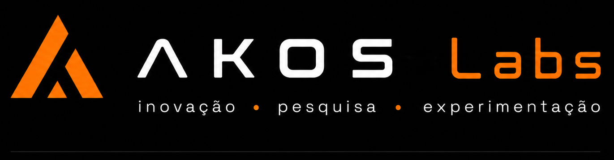

**Labs** é o playground da AKOS. Experimentos, provas de conceito, estudos exploratórios e tudo que ainda não tem escopo fechado. É o espaço da inovação e da pesquisa aplicada.

---

### 🩷 AI
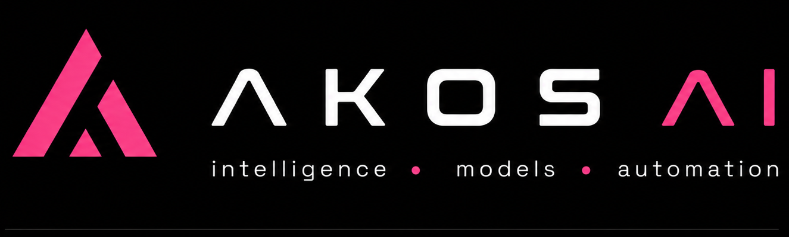

**AI** organiza agentes, modelos e automações inteligentes. Inclui configurações de personalidades, system prompts, ferramentas e fluxos que utilizam inteligência artificial para auxiliar nos projetos.

---

### ☁️ Cloud
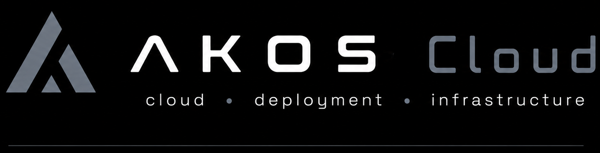

**Cloud** reúne infraestrutura, deploy e serviços em nuvem. Contém configurações de ambientes, Dockerfiles, orquestração e práticas para manter aplicações no ar.

---

### ⚪ OS
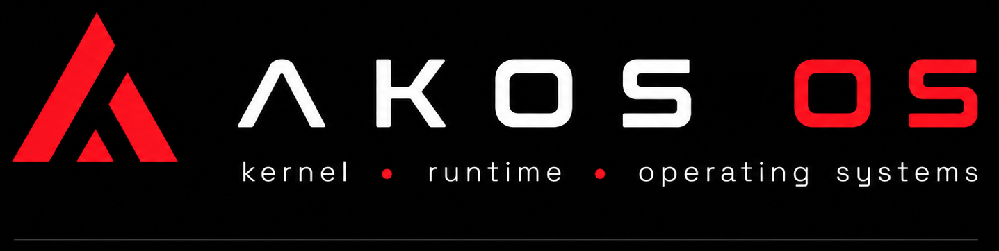

**OS** é o eixo de sistemas operacionais e redes. Contém anotações sobre kernel, gerenciamento de processos, memória, protocolos de rede e tudo que envolve a camada mais baixa do software — incluindo estudos em C++ e chamadas de sistema.

---

### 🟡 Arch
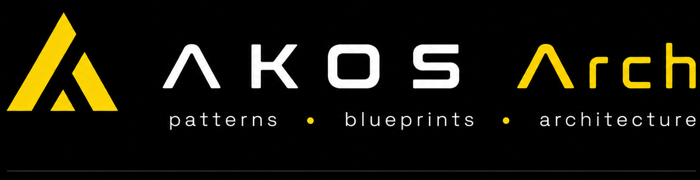

**Arch** é o coração da arquitetura de software. Reúne padrões, blueprints, decisões arquiteturais (ADRs) e diagramas. É onde projetos são desenhados antes de serem implementados.

---

### 🟢 Projects
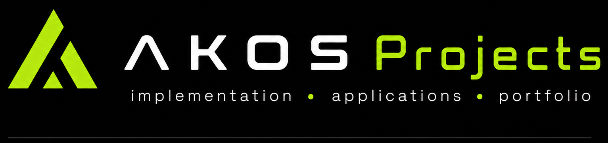

**Projects** abriga as implementações com escopo definido. Aqui ficam o TCC, aplicações finalizadas, portfólios e tudo que saiu do laboratório e se tornou um produto ou entrega concreta.

---

## 🧠 Como funciona a organização

A AKOS é organizada por **eixos**, que funcionam como tags aplicáveis a qualquer conteúdo — repositórios, issues, logbooks, projetos e prompts.

- **Labs** é o playground: experimentos, estudos, provas de conceito.
- **Projects** abriga implementações com escopo definido, como o TCC e aplicações finalizadas.
- **Docs** centraliza guias, templates e referências.
- **Core** guarda os princípios e padrões que orientam a arquitetura da própria AKOS.

---

## 🚀 Começando

Os repositórios estão em estruturação. Acompanhe o progresso pelos eixos acima.

---